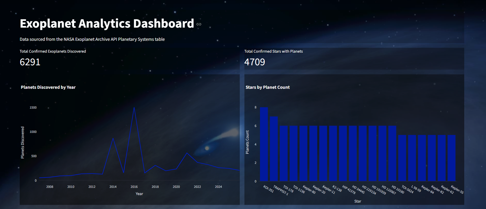

# Exoplanet Analytics Dashboard



## Overview
An end-to-end ETL pipeline and interactive analytics dashboard built on real NASA exoplanet data.
Extracts live data from the NASA Exoplanet Archive API, stores it in a local SQLite database, and visualizes discovery trends through an interactive Streamlit dashboard.

Built to develop real data engineering skills using a real-world NASA data source.

## What It Does
- Extracts confirmed exoplanet data from the NASA Exoplanet Archive TAP API
- Transforms raw JSON responses into structured, clean records
- Loads 6,000+ exoplanet records into a SQLite database
- Visualizes planetary discovery trends and star system data through interactive charts

## Tech Stack
| Tool | Purpose |
|------|---------|
| Python | Core language |
| Requests | API extraction |
| Pandas | Data transformation |
| SQLite | Local data storage |
| Streamlit | Dashboard interface |
| Plotly | Interactive charts |

## Project Structure
```
exoplanet-analytics/
├── .streamlit/
│   └── config.toml
├── src/
│   ├── etl.py
│   ├── database.py
│   └── analytics.py
├── images/
│   └── star_background.jpg
│   └── star_dashboard.jpg
├── app.py
├── requirements.txt
└── README.md
```

## Getting Started

Install dependencies:
```
pip install -r requirements.txt
```

Run the ETL pipeline to populate the database:
```
python src/etl.py
```

Launch the dashboard:
```
streamlit run app.py
```

No API key required — the NASA Exoplanet Archive is fully public.

## Features
- Live data pulled from the NASA Exoplanet Archive Planetary Systems table
- Confirmed exoplanet and star counts as KPI metrics
- Line chart showing planetary discovery trends over time (including the Kepler mission spike)
- Bar chart of stars with the most confirmed exoplanets
- Fully transparent charts over a space-themed background

## What I Learned
- Building a modular ETL pipeline with separation of concerns across extract, transform, and load
- Querying a TAP (Table Access Protocol) compliant API using ADQL
- Persisting and querying structured data with SQLite
- Building an analytics layer with SQL aggregations on top of a database
- Data storytelling through interactive Plotly visualizations in Streamlit

## Roadmap
- [ ] Schedule pipeline runs with Apache Airflow
- [ ] Add discovery method breakdown chart
- [ ] Add planet radius distribution histogram
- [ ] Dockerized deployment

## Data Source
NASA Exoplanet Archive TAP API — Planetary Systems table (ps), maintained by Caltech/IPAC on behalf of NASA.
